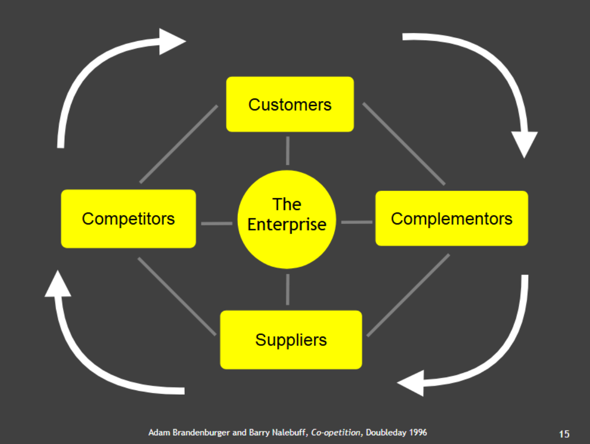
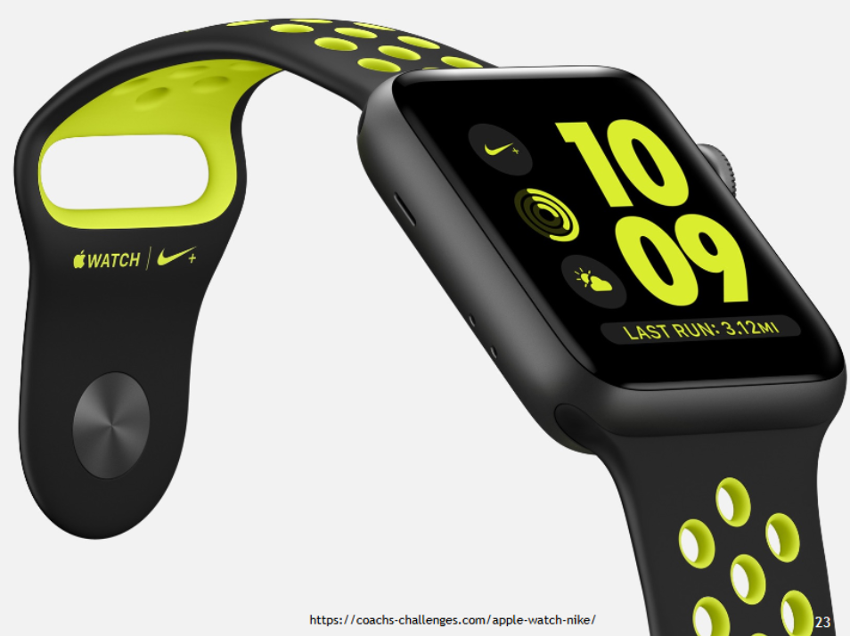
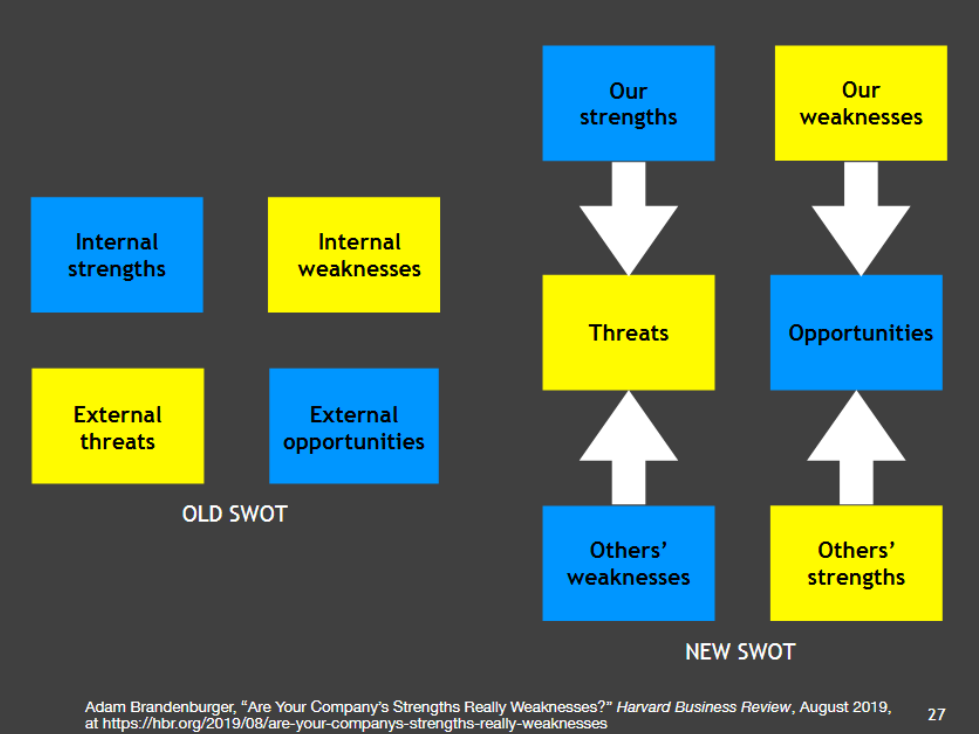

# Article 1 - Adam Brandenburger, Strategy Needs Creativity,Harvard Business Review, March-April 2019

- principle of co- evolution --> if 2 people co-exist--> they are doing something different
- prompts and organizers are componets of the 4 C's

- MECE framework --> mutually exclusive collectively exhaustive--> this is bullshit --> fails all the time

- AI leads to **Intent Amplification**

- Design Thinking as a problem solving approch:
    - **Empathize --> Define --> Ideate --> Prototype --> Test**

## 1. Contrast

- *strategists are very good at borrowing ideas*

- in any case ---> a PARTY can be (mostly is) playing multiple roles 
- complementors can be in different industries

- For example in a charity:
    1. Suppliers: basic --> giving resources
    2. Customers: they get happiness
    3. 

- something to think of --> If suppliers are treated as customers then we can maybe come up with a different approach to get an advantage in business

## 2. Combination

- breadth is important to be able tp combine ideas from different fields

- competitive relationships ALSO HAVE element of **complementarity** --> can be making the market or splitting the market

##### now we also have sunglasses and clothes --> so what I think is: **does combination start from idea of creating an ecosystem**

## 3. Constraint

- enginerers love constaints bcoz it helps them to solve problems

#### INTERNAl && EXTERNAL SWOT

## 4. Context (Switch Context)

-

# Article 2 - Felix Oberholzer-Gee, Eliminate Strategic Overload, Harvard Business Review, May-June 2021

### WTP: The **MAXIMUM** amount a customer is willing to pay for a product or service.

- bad model?
    - can it be quantified?

## WTS: The **MINIMUM** amount a seller is willing to accept to provide a product or service.

"total profit = WTP - Cost" is a very shallow idea --> hence we need WTS

## Value Creation = WTP - WTS --> so doubule sided optimization problem --> **raise WTP && lower WTS simultaneously**

3 slices
    1. to customer
    2. to enterprise
    3. to supplier

# Article 3 - Aithan Shapira, Spark Team Creativity by Embracing Uncertainty, MIT Sloan Management Review, Spring 2020

PROMPT --> Make waiting more bearable

Examples:
    1. Distract them:
        1.1 by telling things about the service/product --> tell advantages, tell similar products
        1.2 In general --> music

    2. Make the relative environment FALSELY POSITIVE
        - too polite officers/service providers
        - Plant actors who act that this wait time is very normal

### APPROACH that can be taken in first half of brainstorming --> **BE LESS SPECIFIC - MORE DIRECTIONAL** 

# Class Activity --> We were group 14 --> Jony Ive