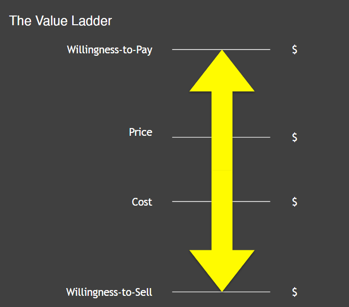
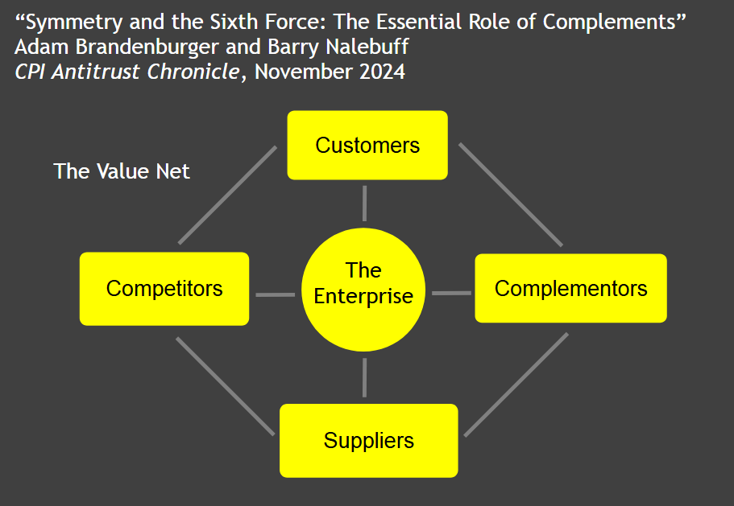
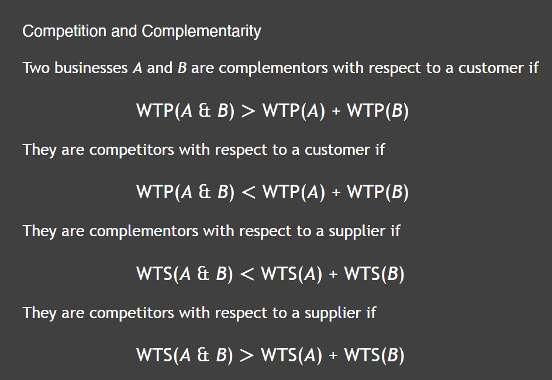

# Basics

- combination is a source of novelty 
    - TBH: it will not be ANYTHING New bcoz it is created from things already present
    - but the thing ITSELF can be new

- whenevre we are in a situation where we are told "we need to make a choice" --> it can also be **BOTH**

# Complementarity

### Detour: The Value Ladder to be thought of

Strategy 1: Raise willingness-to-pay (WTP) and share in the increase --> Understand customers and improve quality, functionality, brand, experience.
Strategy 2: Lower willingness-to-sell (WTS) and share in the increase --> Work with suppliers and lower their costs by sharing information, entering
long-term contracts
Strategy 3: Raise WTP and lower WTS simultaneously --> **BEST init**

## The Value Net

1. competitors can be Complementors

## VERY IMPORTANT RULES

Can be read as:
1. It a customer is willing to pay MORE for coffee & milk as compared to only coffee + only milk --> then it means that tehy are **complementors**
3. Pepsi and Coco Cola are competitiors for suppliers as they both want to create a supply chain and market

players maybe complementors in making a market - and maybe competitiors in dividing the market

# Reading 2: Adam Alter, Anatomy of a Breakthrough: How to Get Unstuck When It Matters Most, Simon & Schuster, 2023, Chapter 8 (“Recombination and Pivoting”), pp. 137-145, 266-267.

#### Two main elements needed:
1. RE-Combination:

2. Randomization:

# Reading 3: Austin Kleon, Steal Like an Artist: 10 Things Nobody Told You About Being Creative, Workman, 2012, Chapter 1 (“Steal Like an Artist”)

# Individual Exercise
To explore Kleon’s notion of “idea income,” let’s each make two lists:
- List A: Come up with the five main sources of ideas you currently take in — people, social media, books, classes, hobbies...:
    1. My Idea & social media:
        - religious path is the only way to find true purpose
        - I NEED MONEY
    2. Books & classes:
        - strategy is important
    3. People:
        - That we should not live calculatively - we should just let life happen
        - 
- List B: Come up with three idea sources you seldom engage with but would like to try
    1. Increase resistance to temptation (to all 7 sins) via spirituality 

Questions to consider:
1. What pattern defines your current idea income?
    - i think "I LIKE" what social media and classes are
    - based on thet liking --> I think I am not with the correct people 
2. What one deliberate change might you consider to raise your idea income over the next month?
    - PIVOT!!! and try to be in places where I can find more aligned people

